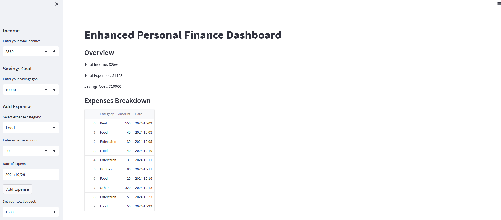
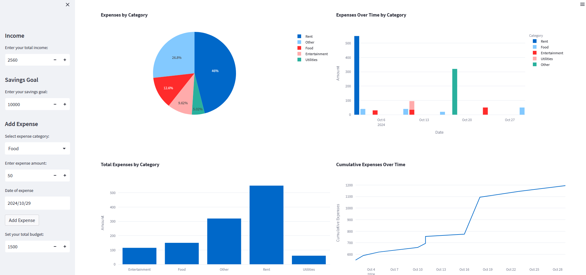
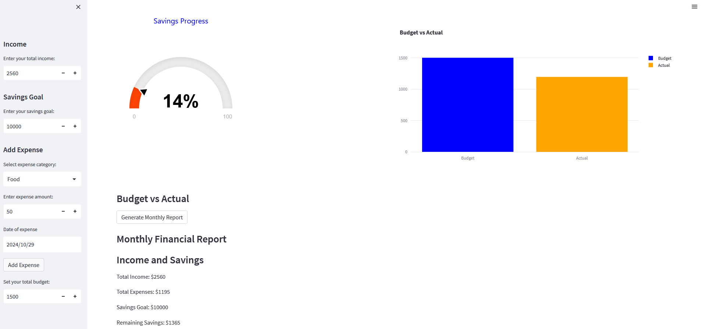

# Personal Finance Dashboard

This **Personal Finance Dashboard** is a web-based application built using Python, Streamlit, and Plotly to help users track their income, expenses, and savings goals. It provides insights into budgeting, spending categories, and financial goals through interactive charts and reports.




## Features

- **Income & Savings Tracking**: Users can input their income and set a savings goal.
- **Expense Management**: Users can add expenses with categories and dates.
- **Data Visualization**: The dashboard offers visual insights with various charts, including:
  - Expenses by category (Pie chart)
  - Expenses over time by category (Bar chart)
  - Cumulative expenses (Line chart)
  - Budget vs Actual (Bar chart)
- **Savings Progress Gauge**: A JustGage-based gauge to track savings progress visually.
- **Monthly Financial Report**: Automatically generate a report based on user input.

## Tech Stack

- **Backend**: Python 3.x
- **Frontend**: Streamlit for the user interface, Plotly for charts
- **Data Management**: Pandas for managing and analyzing expense data

## Installation

### Prerequisites

Before running the dashboard, ensure you have the following installed:

- **Python 3.7+**
- **Pip** for managing Python packages

### Setup

1. Clone the repository or download the project files.

   ```bash
   git clone https://github.com/yourusername/Personal_Finance_Dashboard.git
   cd Personal_Finance_Dashboard
   
2. Create a virtual environment (recommended):

  ```bash
  python -m venv venv
  ```

Activate the virtual environment:

  ```bash
  venv\Scripts\activate
  ```

Install required dependencies:

```bash
pip install -r requirements.txt
```

Run the Streamlit app:

```bash
streamlit run mainpage.py
```
Open your browser and go to http://localhost:8501 to access the dashboard.

Usage

  Enter your income: On the sidebar, enter your total income.
  Set your savings goal: Specify how much you want to save.
  Add expenses: Use the sidebar to input your expenses, categorizing them as needed.
  View insights: Analyze your financial data through various visualizations and the monthly financial report.
